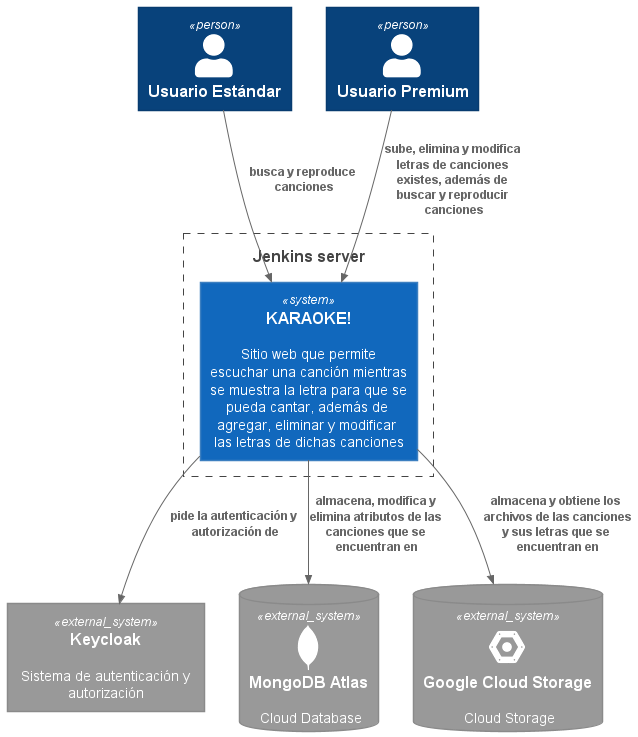
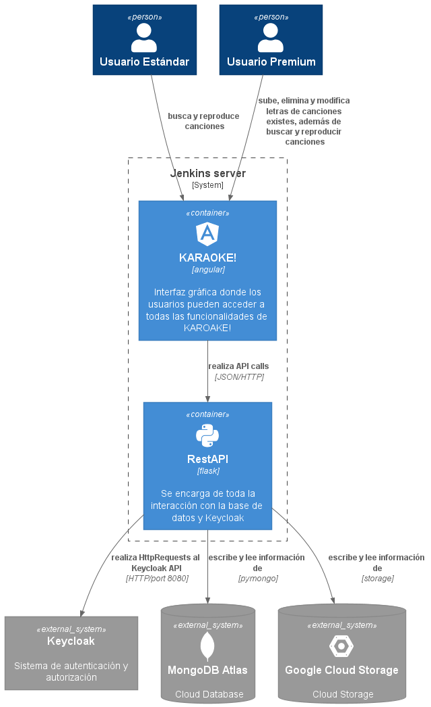
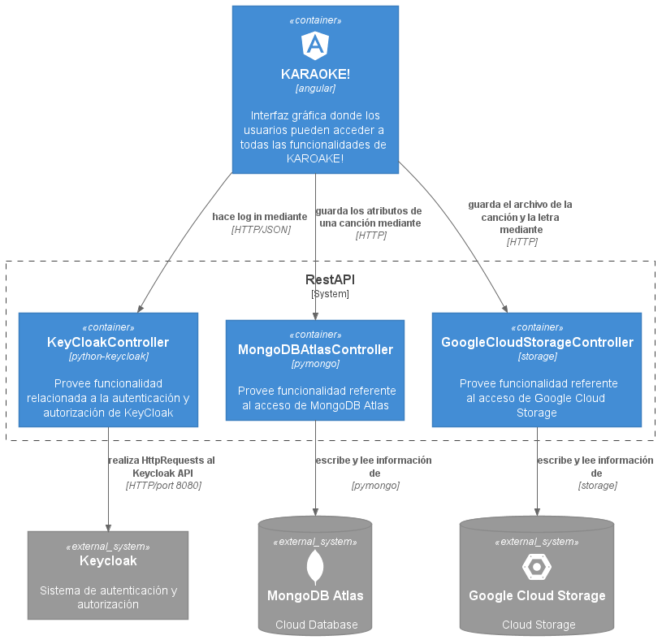
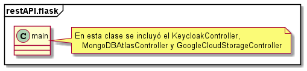

# KARAOKE!

## Diagramas según el modelo C4

### Diagrama de Contexto

### Diagrama de Contenedores

### Diagrama de Componentes

### Diagrama de Código

## Documentación de decisiones tomadas en el proyecto
### Lenguajes de programación
 - Se utilizó Typescript para el desarrollo del FrontEnd ya que primeramente Angular, el framework que se utilizará para este fin, está escrito en este lenguaje, por lo que es recomendado para crear aplicaciones con Angular, además que ofrece beneficios sobre Javascript como reducir bugs y poder modificar el código sin ningún tipo de problema.
 
- Se utilizó Python para el desarrollo del BackEnd, ya que este ofrece extensibilidad, lo cual se consideró importante para el tipo de aplicación que es KARAOKE!, ya que permite agregar más características y funcionalidades al sistema.

### Frameworks/Toolkits
- Como se mencionó anteriormente se utilizará Angular para el FrontEnd, debido a que este framework ofrece características como la creación de “Single Page Application”, lo que hace que los cambios realizados se ven instantáneamente reflejados, también su orientación a que el código se divida en componentes hace que sea más organizado, escalable y fácil para la detección de errores. Además, un factor muy determinante fue que uno de los desarrolladores del FrontEnd, posee gran experiencia con Angular.
 
 - Se utilizará Flask para el desarrollo del BackEnd, ya que este es un microframework que es muy recomendado para la primera aproximación de desarrollo web con Python ya que no incluye archivos de todos los features que ofrece Flask, al menos de que se indique lo contrario, lo cual ayuda mucho al orden y entendimiento de cada parte que se desarrollará en el proyecto, además que Python ofrece bibliotecas muy útiles y de fácil implementación para futuros features que se pudiesen agregar.
 
- Se escogió Python-KeyCloak para la parte de autenticación y autorización del server, ya que este es un paquete de Python que permite acceder al API de Keycloak de una manera sencilla.

- Para la conexión con la base de datos, se utilizó  PyMongo ya que esta es la herramienta recomendada cuando se quiere trabajar con MongoDB desde Python.

### Tecnología de base de datos

- Se decidió utilizar una base de datos no relacional ya que se estará trabajando con datos no estructurados o semiestructurados, tales como los que se reciben del API de KeyCloak y documentos como los .lrc de las canciones. En cuanto a la implementación de la base de datos, se utilizó como servicio, específicamente, MongoDB Atlas que es una base de datos en la nube manejada y supervisada automáticamente y como proveedor de servicio de nube se escogió GCP.

### Estándares de programación
- Se seguirá la guía de estilo de código Pep8 propia para Python, ya que este permite una mejora legibilidad del código y reduce el costo del desarrollo del equipo.
- Además se utilizará Pylint para verificación de código como revisar que todos los módulos importados sean usados y detectar código duplicado

- También se utilizará  Black como code-formatter ya que sigue los estándares de código PEP8 y tiene mejores prácticas que otros code-formatters.
- Adicionalmente, se usará Pylint y Flake8 para detección de errores sintácticos y de estilos en el código fuente de Python, como el uso de variables que no estén instanciadas o variables indefinidas, llamada a métodos indefinidos o paréntesis faltantes e inclusive intento de redefinir tipos o funciones integradas.

### Organización/layout de los proyectos

- Se utilizará una organización estructural basada en el proyecto, ya que este permite que managers tomen todas las decisiones del proyecto con facilidad, además que favorece a la claridad de los objetivos y estrategias del proyecto entre los diferentes equipos de desarrollo.

- En cuanto la estructura de archivos, se manejó de manera independiente todos los archivos de RestAPI , interfaz gráfica y documentación, para un manejo más organizado de todos los archivos
